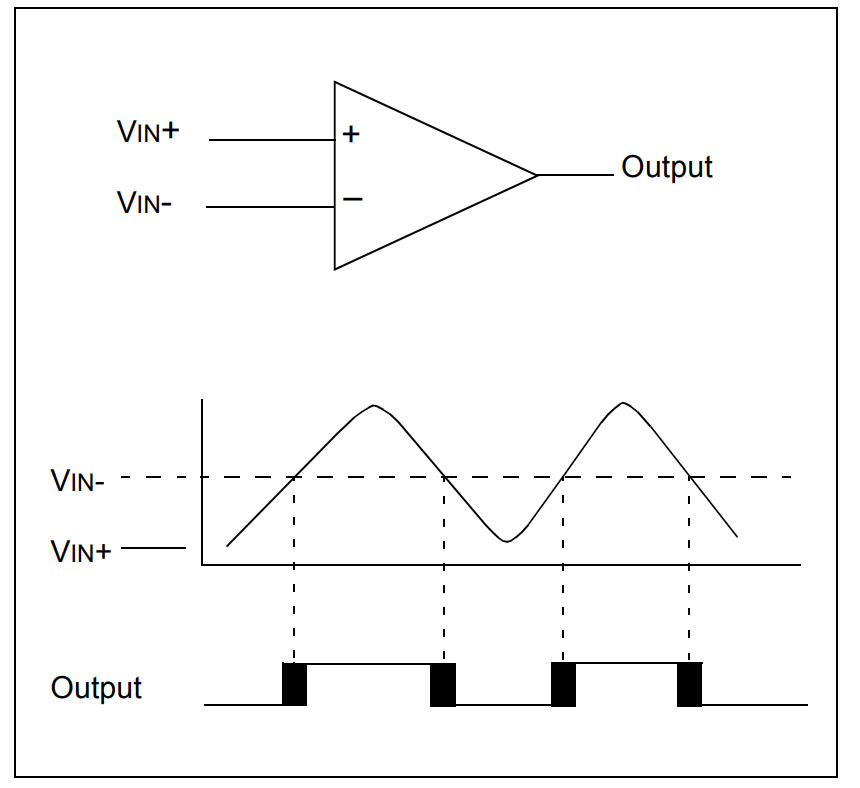

# Digital_mixed_signal (DMS)

### Simulación del modelo de un comparador analógico usando RNM (Real-Number Modeling) para ser modelado Digitalmente.

 A partir de un modelo Analógico, en este caso un comparados, se hizo su representación digital, usando RNM, para describir o modelar un bloque analógico. 

 

Este proyecto fue simulado utilizando las herramientas de Synopsys.

### Colocar en el bash lo siguiente
- setenv GIT_ROOT `git rev-parse --show-toplevel`
- setenv UVM_WORK $GIT_ROOT/work/uvm
- mkdir -p $UVM_WORK && cd $UVM_WORK
- ln -sf $GIT_ROOT/hw/Makefile/Makefile.vcs Makefile